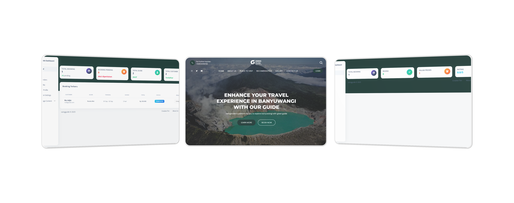

 
  

# By   : Rio Adjie Wiguna
 

#  💻 Tentang Web
Osing Guide merupakan platform untuk memesan guide di kota Banyuwangi

## 📸 Gambaran Umum Osing Guide

 

Terdapat 3 role dalam web ini dengan fitur masing-masing pengguna sebagai berikut:
1. Admin
- Dasbor Admin berisi informasi platform dan booking guide
- Manajemen Konten Landing Page meliputi: Tempat Wisata, Galeri, Tentang Kami dan Kontak
- Manajemen Profil Guide dan Profil Customer
- Manajemen Booking Order Guide
- Manajemen Komisi Platform

2. Guide
- Dasbor Guide berisi informasi booking guide tersebut
- Mengisi Profil Guide
- Kelola Ketersediaan waktu guide
- Melihat Pesanan 
- Melihat Review

3. Customer
- Profil Customer
- Riwayat Booking
- Melihat list guide dan isi platform

 

# 📃 Cara Install Aplikasi dengan Framework Laravel

## ▶️ Spesifikasi Laravel

- PHP ^10.x.x
- PHP Composer
- Database MySQL

## ▶️ Instalasi Aplikasi

1. Clone atau download source code di Github
   - Melalui Terminal, clone repository `git clone https://github.com/rioadjie/JD_049-RioAdjieWiguna-osingguide.git`
   - Jika tidak menggunakan terminal dapat **Download Zip** dan _extract_ ke direktori web server (example: xampp/htdocs)
2. `cd JD_049-RioAdjieWiguna-osingguide`
3. `composer install`
4. `cp .env.example .env`
   - Jika tidak menggunakan GIT,  rename file `.env.example` ke `.env`
5. Dari terminal `php artisan key:generate`
6. Create **database from mysql** untuk aplikasi web ini
7. **Setting database** dari file `.env`
8. `php artisan migrate`
9. `php artisan db:seed`
10. Jalankan `php artisan serve` untuk memulai web
11. Instalasi Selesai
 

   
